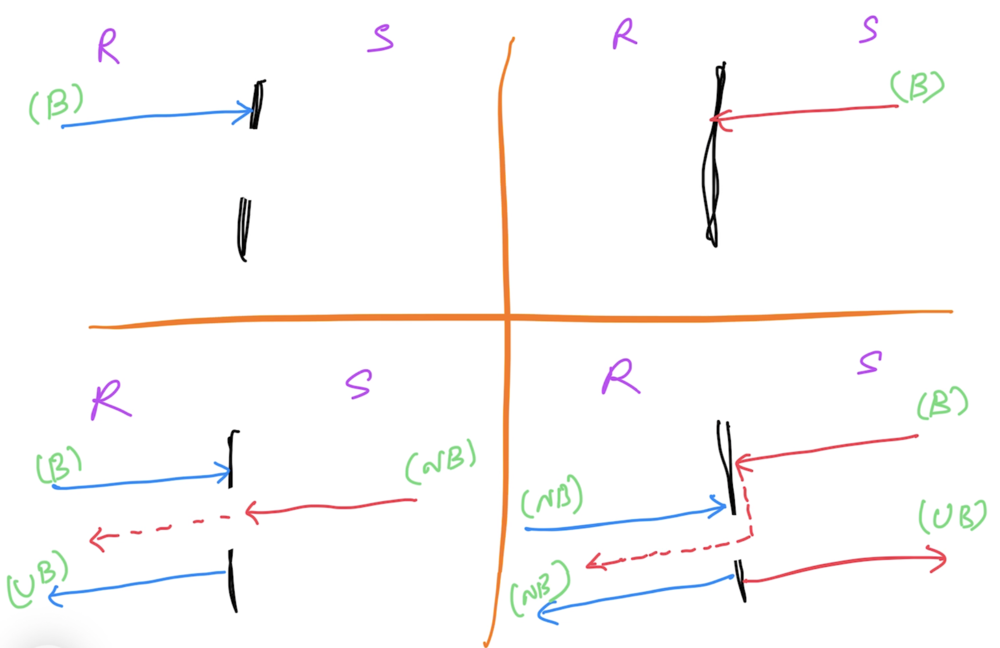

# Go Intermediate

## Magesh Kuppan
- tkmagesh77@gmail.com

## Software Requirements
- go tools
- VS Code (any editor)

## Pre-requisites
- Must be familiar with the following
    - Variables, Constants & Data Types
    - Control Structures
    - Collection Types
    - Error Handling
    - Higher Order Functions
    - Deferred Functions
    - Panic & Recovery
    - Structs & Methods
    - Interfaces

## Schedule
| What | When |
|------|------|
| Commence | 9:30 AM |
| Tea Break | 11:00 AM (20 mins) |
| Lunch Break | 01:00 PM (1 hour) |
| Tea Break | 03:15 PM (20 mins) |
| Wind up | 4:30 PM |

## Repo
- https://github.com/tkmagesh/Nutanix-GoIntermediate-Aug-2024

## Agenda
### Day-1
- Concurrency
- Concurrency Patterns
- Testing

### Day-2
- IO
- Database Programming
- HTTP Services

### References
- Growing Object Oriented Software Guided By Tests

## Recap
### Interfaces
- Contracts
- Loose Coupling
- Implicitly Implemented

### Panic & Recovery
#### Panic
- State of the application where the execution cannot proceed further
    - However, functions that are already deferred will be executed
- Use "panic()" to create a panic
#### Recovery
- Use "recover()" to gain access to the error that resulted in the panic

### Higher Order Functions
- Functions as data
- Functions can be passed as arguments
- Functions can be returned as return values

## Concurrency
- Ability to have more than one execution path
- Typically, concurrency is achieved using OS threads
- OS Thread scheduler is responsible for scheduling the thread execution in the processor
- Scheduling Strategies
    - Cooperative Multi tasking
    - Pre-emptive Multi tasking
### OS Thread based concurrency
- OS Threads are costly 
    - ~2MB of RAM / thread
    - context switch are costly
    - creating & destroying threads are costly (mitigate by using "thread pools)

## Go Concurrency
- Goroutines
    - A concurrent operation representation in Go
    - Cheap (~4KB)
- Builtin Scheduler
    - As a part of the application binary


### WaitGroup
- Synchronization Api
- Semaphore based counter
- Capable of blocking the exeuction of a function until the counter becomes 0

### Data Race
#### Run with race detector
```
go run --race [program.go]
```
#### Build with race detector
```
go build --race [program.go]
```

### Channels
- Data type created to enable communication between goroutines
#### Declaration
```go
var ch chan int
```
#### Initialization
```go
ch = make(chan int)
```
#### Declaration & Initialization
```go
var ch chan int = make(chan int)

// OR (use type inference)
var ch = make(chan int)

// OR
ch := make(chan int)
```
#### Channel Operation ( using <- operator )
##### Send Operation
```go
ch <- 100
```
##### Receive Operation
```go
data := <- ch
```
#### Channel Behavior


### Context
- Cancel Propagation
- context package
- context factory functions
    - context.Background()
        - used to create a top-level context
        - NON cancellable
    - context.WithCancel()
        - programmatically cancellable
    - context.WithTimeout()
        - programmatically cancellable
        - auto cancellable by timeout
        - based on relative time
    - context.WithDeadline()
        - programmatically cancellable
        - auto cancellable by timeout
        - based on absolute time
    - context.WithValue()
        - share data through context hierarchy
        - NON cancellable

## Database Programming
- Standard Library
    - database/sql package